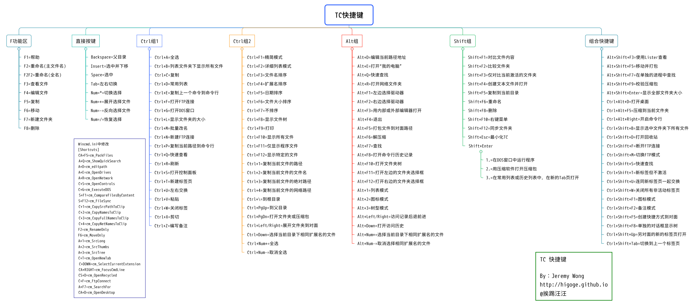

# 快捷键

```txt
F2 重命名
F3 查看文件
F4 编辑文件
F5 复制
F6 移动
F7 新建文件夹
Del 删除

Space 选中
Ctrl+\ 到根目录
Ctrl+A 全选
Ctrl+B 显示文件夹下所有文件
Ctrl+C 复制
Ctrl+D 常用列表
Ctrl+F 搜索
Ctrl+G 打开命令提示符
Ctrl+W 关闭标签
Ctrl+Q 快速查看
Ctrl+R 刷新
Ctrl+T 新建标签页并激活
Ctrl+Shift+T 新建标签页但不激活
Ctrl+Left/Right 在左/右窗口打开当前目录/文件

Shift+F1 对比文件内容
Shift+F2 对比文件夹
Shift+F10 打开右键菜单

Alt+F5 压缩文件
Alt+F6 解压缩
Alt+Left/Right 历史记录切换
Alt+Down 查看历史记录
```



